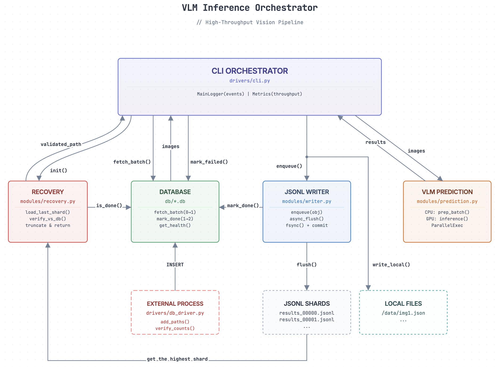
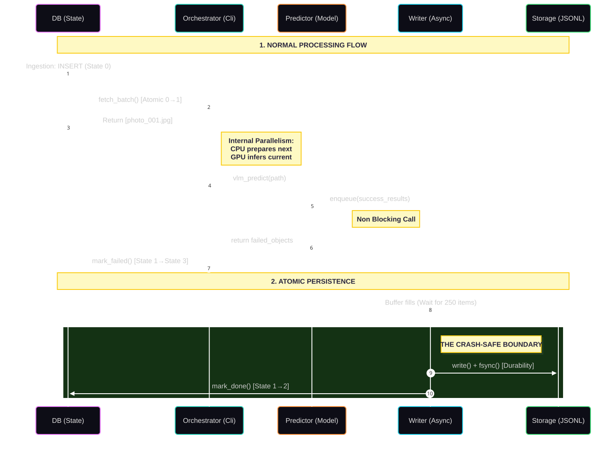

> **📌 Note:** This README has been last updated till v0.3.3. While we've added many features since then, there might be slight drift in the actual implementation compared to what's documented here. However, the core framework remains the same. It is highly recommended to read this document to understand the codebase architecture and design philosophy. You can see [CHANGELOG.md](../../CHANGELOG.md) if you want to follow the actual changes since v0.3.3.

---

# Vision Ingestion Engine : A Scalable Data Pipeline Engineered for Resilience

**Author:** Srihari Bandarupalli

---

## 🌟 Overview

This codebase is a production-ready engine for processing massive image datasets with Vision-Language Models (VLMs). You simply provide a root directory containing millions or billions of images, and the system automatically constructs an SQLite database to organize the workload. It leverages vLLM for high-performance GPU inference and streams results into JSONL files (one entry per image), automatically rotating to a new file at 1GB.

Designed for absolute resilience, you can stop, restart, or crash the pipeline randomly and resume seamlessly with guaranteed data consistency. Every operation is also logged in detail, providing full visibility for debugging and performance tracking.

> While this implementation is tailored for VLM inference, the core architecture—handling state tracking, recovery, and concurrent I/O—is modular. It can be easily adapted for any other type of large-scale image processing or data transformation task by simply swapping the inference module.
---

## 📑 Table of Contents

1. [The Challenge](#-the-challenge-processing-a-billion-images-without-failure)
2. [For New Users](#-for-new-users)
3. [The Components](#-the-components-specialists-in-harmony)
4. [System Topology](#-system-topology-component-interaction)
5. [An Image's Journey](#-an-images-journey-the-narrative)
6. [Architectural Pillars](#-architectural-pillars-the-elegance-of-the-design)
    - [Scalable State Management](#-pillar-1-scalable-state-management--design-choices-that-scale-to-billions)
    - [Crash Safety](#-pillar-2-uncompromising-crash-safety--the-write-fsync-commit-protocol)
    - [Decoupled Throughput](#-pillar-3-decoupled-throughput--maximizing-every-cycle)
    - [Stateless Parallelism](#-pillar-4-stateless-parallelism--bootstrap-process-flush)
7. [Design Philosophy](#-design-philosophy-why-this-architecture-wins)
8. [Operational Guide](#-operational-guide)
9. [Monitoring & Observability](#-monitoring--observability)
10. [Documentation Index](#-documentation-index)

---

## 🎓 For New Users

**How to navigate this documentation:**

1.  **Just want to run it?**
    See **[QUICKSTART](../../README.md)** for a 3-step guide using `run_pipeline.sh`.

2.  **Read this README linearly first.**
    We recommend reading this document from top to bottom *before* clicking the deep-dive links in the component sections. Get the high-level picture first; the implementation details can wait.

3.  **Ready to run?**
    Go directly to the **[Operational Guide](#-operational-guide)** for configuration and execution commands.

3.  **⚠️ CRITICAL: Know the Limits**
    Before processing your first batch, you **must** read:
    * **[Operational Realities & Limitations](#%EF%B8%8F-operational-realities--limitations)** — Understand exactly where the system has limitations and the specific scenarios where it might fail.
    * **[Maintenance Operations](#%EF%B8%8F-maintenance-operations)** — Learn the mandatory procedures to handle these failures and maintain data integrity at scale.

---

## 🎯 The Challenge: Processing a Billion Images Without Failure

At billion-image scale, the problem isn't just processing—it's **orchestrating perfect consistency across crashes, managing exactly-once semantics, and maximizing throughput when every millisecond of idle time compounds into hours of wasted compute**. Conventional approaches fail catastrophically:

- ❌ **Naive batch processing:** One crash loses hours of work, duplicate processing burns GPU cycles
- ❌ **File-based state tracking:** Race conditions corrupt metadata, recovery is manual and error-prone  
- ❌ **Sequential pipelines:** CPU waits for GPU, GPU waits for disk—resources idle 50%+ of the time
- ❌ **Single-database designs:** Ingestion blocks workers, lock contention stalls throughput

**This system solves three hard problems simultaneously:**

1. **🛡️ Uncompromising Data Safety** — Crashes must be recoverable with zero data loss and deterministic replay
2. **⚡ Extreme Throughput** — Maximize CPU/GPU overlap, never block on I/O, eliminate all idle time
3. **🎯 Scalable State Management** — Exactly-once processing semantics at 100M–1B+ image scale

This is not a collection of scripts. It's a **cohesive system where every design choice—from dual databases to 250-line fsync boundaries—serves operational resilience and throughput**. The architecture reveals elegant solutions to problems that crash conventional pipelines.

---

## 🔧 The Components: Specialists in Harmony

Each component is a specialist that exposes a minimal, well-defined interface to the orchestrator. Understanding these five specialists is key to understanding how this system achieves its reliability and throughput guarantees.

### 📦 Database Layer (`db/`)
**Role:** The system's infallible source of truth for processing state.
* **Key Feature:** Dual-database architecture eliminates lock contention.
* **Guarantee:** Exactly-once processing via atomic fetch prevents double-fetch.
* **Performance Note:** Supports both folder walking (os.walk) and pre-generated file lists. Using `find` command to generate file lists is **exponentially faster** than os.walk for large datasets (minutes vs hours).
* **Multi-Stage Support:** Independent DBs per stage with State 4 (Upstream-Ready) for cross-stage coordination. **Previous stage** writes state=4 to **current stage's database** after completion. First stage fetches from state=0, intermediate stages fetch from state=4.
* **Schema Evolution:** Idempotent initialization auto-migrates existing DBs (adds `shard_path` column for output lineage tracking, State 4 support).
* **Shard Path Tracking:** Records output JSONL shard location in DB for each processed image, enabling result lineage and recovery.
* **[Read the deep dive](db/db_readme.md)**

### 🔄 Recovery System (`modules/recovery.py`)
**Role:** Ensures JSONL ↔ DB consistency by validating and truncating corrupted tail regions after crashes.
* **Key Feature:** Runs before writer initialization, validating only the last 250 lines.
* **Guarantee:** System state is always consistent before processing begins.
* **[Read the deep dive](modules/recovery_readme.md)**

### 🔮 VLM Prediction (`modules/prediction.py`)
**Role:** Orchestrates CPU/GPU parallelism to maximize throughput.
* **Key Feature:** Bootstrap-process-flush pattern makes GPU wait time near zero.
* **Project Abstraction:** Uses `prompt_validation_object` for custom logic (see `examples/example1/project_specific.py`).
* **Multi-Pipeline Support:** Accepts shared `vlm_config`/`vlm_service` to enable multiple pipelines using one model instance.
* **Guarantee:** Stateless functional design eliminates concurrency bugs.
* **[Read the deep dive](modules/prediction_readme.md)**

### 📝 JSONL Writer (`modules/writer.py`)
**Role:** Non-blocking, crash-safe persistence with atomic fsync-DB synchronization.
* **Key Feature:** Background thread handles physical disk I/O, allowing main loop to run at full speed.
* **Guarantee:** Data is physically durable (fsync) before being marked done in DB.
* **Multi-Stage Support:** Optional `next_stage_db` for atomic cross-stage transitions (mark current stage done, next stage ready).
* **Shard Tracking:** Records `shard_path` in DB for each processed image, enabling lineage tracking.
* **[Read the deep dive](modules/writer_readme.md)**

### 🎯 Pipeline Orchestrator (`examples/example1/main.py` → `drivers/cli.py`)
**Role:** Lifecycle management through dependency-ordered initialization and fail-fast error propagation.
* **Entry Point:** User's `main.py` (e.g., `examples/example1/main.py`) parses arguments and calls `cli()` with project-specific logic (`prompt_validation_object`) and optional shared VLM resources.
* **Key Feature:** Organizes complexity through alignment (FSYNC_EVERY_LINES) and clean dependency chains.
* **Multi-Pipeline Support:** Accepts pre-initialized VLM config/service for resource sharing across pipelines.
* **Guarantee:** No partial states—the system is either running perfectly or stopped safely.
* **[Read the deep dive](drivers/cli_readme.md)**

---

## 🏗️ System Topology: Component Interaction

Now that you know what each component does, let's see how they interact together to form a cohesive system:



**Component Relationships:**

- **CLI Orchestrator** serves as the central hub coordinating all components
- **Database** provides atomic state transitions (pending → processing → done)
- **Recovery** validates consistency before startup, ensuring JSONL ↔ DB alignment
- **VLM Prediction** executes parallel CPU/GPU workloads with zero coordination overhead
- **Writer** decouples persistence from processing via async background flushing
- **External Process** (db_driver.py) handles ingestion independently without blocking workers

### Image State Machine

Every image transitions through a strict lifecycle across two databases:


```
┌─────────────────────────────────────────────────────────────────────────────┐
│                          IMAGE LIFECYCLE (DB LAYER)                         │
└─────────────────────────────────────────────────────────────────────────────┘

      [ INGESTION PHASE ]                      [ PROCESSING PHASE ]
      (seen_cache.db)                           (images.db)

   NEW PATH       ┌────────────┐               ┌──────────────┐
   ───────────────┤ SEEN CACHE ├───────────────┤   PENDING    │
    (Dedupe)      │  (Filter)  │               │   state=0    │
                  └────────────┘               └──────┬───────┘
                                                      │
                                                      │ fetch_batch()
                                                      │ (Atomic 0→1 or 4→1)
                                                      ↓
      ┌────────────┐                           ┌──────────────┐
      │  RECOVERY  │◀────── Reset 1→0 ─────────┤  PROCESSING  │
      │ (Self-Heal)│      (on crash)           │   state=1    │
      └────────────┘                           └──────┬───────┘
                                                      │
                        ┌─────────────────────────────┼────────────────────────┐
                        │                             │                        │
                 mark_done()                   mark_failed()            crash/timeout
                 (with shard_path)             (log error)              (stuck path)
                        │                             │                        │
                        ↓                             ↓                        ↓
                ┌────────────┐                ┌────────────┐           ┌────────────┐
                │    DONE    │                │   FAILED   │           │ PROCESSING │
                │  state=2   │                │   state=3  │           │ (STUCK)    │
                └──────┬─────┘                └────────────┘           └────────────┘
                       │
                       │ (If Multi-stage: Handoff to Next DB)
                       ↓
                ┌──────────────┐
                │ UPSTREAM-    │  Current Stage: state=2
                │ READY        │  Next Stage DB: state=4
                │ state=4      │
                └──────────────┘

State Semantics:
─────────────────
0 (PENDING):        Ingested, ready for processing
1 (PROCESSING):     Fetched by orchestrator, currently in pipeline
2 (DONE):           Successfully processed, written to JSONL, fsync'd
3 (FAILED):         Processing error (logged for investigation)
4 (UPSTREAM-READY): (Multi-stage only) Processed, ready for next stage

Crash Recovery:     All state=1 → state=0 (batch will be replayed)

Multi-Stage Pipelines:
────────────────────────
State 4 enables cross-stage coordination:
  - Each stage uses its own database (stage1.db, stage2.db, etc.)
  - When a stage completes: marks state=2 in its own DB
  - Cross-stage handoff: **previous stage** writes state=4 to **next stage's DB**
  - Next stage's fetch_batch() selects from state=4 (not state=0)
  - First stage always fetches from state=0 (newly ingested)

Each stage uses independent databases for isolation and scaling.
```

---

## 📖 An Image's Journey: The Narrative

Now that you understand the components individually and how they interact together, let's trace how a single image flows through the entire system. This concrete narrative ties everything together:



**The Five-Stage Pipeline:**

### 1. **INGESTION** (db_driver.py)
- Image path `/data/images/photo_001.jpg` is discovered from:
  - **Option A (RECOMMENDED):** Pre-generated file list (one path per line) - **MUCH FASTER**
  - **Option B:** Folder walking with os.walk - **VERY SLOW** for large datasets
- `seen_cache.db` checks if already processed → Skip if yes, continue if no
- `images.db` INSERT with `state = 0` (pending) for first-stage or single-stage pipelines
- For multi-stage: Previous stage inserts with `state = 4` (upstream-ready) into next stage's DB

**Performance Tip:** Generate file list with `find /path/to/images -type f \( -iname "*.png" -o -iname "*.jpg" -o -iname "*.jpeg" \) > images.txt`. This can save hours on million+ image datasets!

### 2. **FETCH** (CLI Orchestrator)
- `DB.fetch_batch(32, fetch_state)` atomically transitions paths to state=1 (processing)
  - **First stage or single-stage:** Fetches from `state=0` → transitions `0→1`
  - **Intermediate/downstream stages:** Fetches from `state=4` → transitions `4→1`
- Returns batch of 32 paths, including `photo_001.jpg`
- Atomic fetch ensures no two workers process the same image

### 3. **PREDICTION** (VLM Pipeline)
- **Bootstrap:** Load image → Extract metadata → Fill prompt template
- **Parallel Execution:**
  - CPU: Prepare next batch's prompts (I/O bound)
  - GPU: Run VLM inference on current batch (compute bound)
- **Validation:** Parse JSON → Validate schema → Retry on failure (3x)
- **Result:** Structured VLM output or failure flag

### 4. **PERSISTENCE** (Writer + DB)
Success path:
- `writer.enqueue(obj)` → Non-blocking queue (returns instantly)
- **Background Thread:**
  - Buffer fills (250 objects) → Flush triggered
  - `write()` → Lines written to JSONL shard (e.g., `/output/shard_0001.jsonl`)
  - `fsync()` → Force physical disk write (durability)
  - `DB.mark_done()` → Atomically: `state 1→2`, records `shard_path` for lineage tracking
  - **Multi-stage handoff (if configured):** Also marks `state=4` in next stage's DB
- **Result:** JSONL shard + DB state + shard_path + local JSON perfectly synchronized

### 5. **RECOVERY** (On Next Startup)
System crashed? No problem:
- Recovery scans last 250 lines of JSONL shard
- For each line: Is it in DB with `state=done`?
  - ✅ Yes → Keep line
  - ❌ No → Truncate (crash happened after write, before DB commit)
- **Result:** JSONL ↔ DB consistency restored, safe to resume

---

**Crash Safety Guarantee:**
At most 250 images (FSYNC_EVERY_LINES) replayed on restart. All other work is durably persisted and verified.

---

**The beauty:** Each stage is designed to fail safely. Crashes can occur at any point, and recovery deterministically restores consistency. No heroic error handling required—**the architecture guarantees recoverability**.

---

## 🏛️ Architectural Pillars: The Elegance of the Design

These are the core innovations that make the system work at scale. Each pillar solves a hard problem that crashes conventional systems. The sections below provide the conceptual foundation—refer to the component readmes for implementation details.

### 🎯 Pillar 1: Scalable State Management — Design Choices That Scale to Billions

**The Problem:** At billion-image scale, naive designs fail catastrophically. Single-database systems create lock contention. `COUNT(*)` queries become unusably slow. Monolithic JSONL files corrupt entire datasets on crashes.

**The Solution:** Three architectural decisions that enable horizontal scalability:

**1. Dual-Database Architecture** — Separate deduplication (`seen_cache.db`) from state management (`images.db`). Ingestion and processing run concurrently with zero lock contention. Workers never stall waiting for 32K-batch ingestion operations to complete.

**2. Cached State Counts** — A dedicated `state_counts` table maintains running totals (pending/processing/done/failed/upstream-ready) updated atomically on every state transition. Health monitoring remains O(1) even at 100M+ images—no expensive `COUNT(*)` queries scanning full tables.

**2.1. Multi-Stage Coordination** — State 4 (Upstream-Ready) enables independent pipeline stages to coordinate. Each stage uses its own DB for isolation, and atomic cross-stage transitions prevent data loss during crashes.

**3. Automatic JSONL Sharding** — Writer rotates to new shard files when size exceeds 1GB. Crash recovery validates only the active shard's tail region (250 lines), leaving older shards untouched. Corruption is isolated, recovery is fast, and parallel analysis is trivial.

**The Guarantee:** Exactly-once processing via atomic state transitions. Ingestion can add millions of images without blocking workers. Health checks remain instant at any scale. Crash recovery operates on bounded regions regardless of total dataset size.

**The Beauty:** Scalability emerges naturally from architectural constraints. As data grows from millions to billions, performance characteristics remain constant.

**📖 Database Deep Dive:** [`db/db_readme.md`](db/db_readme.md) — Dual-database rationale, O(1) health checks, concurrency model  
**📖 Writer Sharding:** [`modules/writer_readme.md`](modules/writer_readme.md) — Automatic rotation, shard limits, recovery boundaries

---

### 🛡️ Pillar 2: Uncompromising Crash Safety — The Write-Fsync-Commit Protocol

**The Problem:** At billion-image scale, crashes are inevitable. Systems fail when JSONL files, databases, and logs fall out of sync, making recovery ambiguous or impossible.

**The Solution:** A strict atomic protocol where **all state changes align at 250-image boundaries**:

```
Every 250 Images (FSYNC_EVERY_LINES):

  write() → fsync() → DB.mark_done() → log_checkpoint()
    ↓         ↓            ↓                 ↓
  Buffer   Physical    Atomic State    System Health
  to File  Durability  Transition      Snapshot
```

**The Critical Insight:** Recovery only validates the **last 250 lines** (the unflushed tail region). Older data is guaranteed safe because once fsync'd and marked done in DB, it's permanent. Crashes always resolve to the nearest 250-image boundary.

**The Result:** Deterministic recovery with at most 250 images replayed after crashes. No ambiguity, no data loss, no manual intervention.

**📖 Deep Dive:** [`modules/writer_readme.md`](modules/writer_readme.md) — Atomic flush protocol, crash scenario analysis

**📖 Recovery Details:** [`modules/recovery_readme.md`](modules/recovery_readme.md) — Tail validation, truncation algorithm

---

### ⚡ Pillar 3: Decoupled Throughput — Maximizing Every Cycle

**The Problem:** Sequential pipelines waste resources. When CPU prepares batches while GPU idles, or the pipeline blocks on disk writes, you're burning money on idle compute.

**The Solution:** **Two-level parallelism** that keeps CPU, GPU, and disk working simultaneously:

**Level 1: CPU/GPU Overlap** — The prediction module uses a **bootstrap-process-flush pattern**. While GPU processes batch `i`, CPU prepares batch `i+1`. No coordination overhead—just pure functional parallelism. The bottleneck reveals itself naturally.

**Level 2: Non-Blocking I/O** — The writer decouples the entire pipeline from disk latency via background thread. The main thread never waits for fsync or DB updates. Pipeline continues at full speed while writer handles persistence in the background.

**The Result:** Resources work in parallel without blocking each other. Checkpoint metrics reveal which resource (CPU, GPU, or disk) is the true bottleneck.

**📖 Parallelism Deep Dive:** [`modules/prediction_readme.md`](modules/prediction_readme.md) — Bootstrap-process-flush pattern, threading model

**📖 Async I/O Details:** [`modules/writer_readme.md`](modules/writer_readme.md) — Queue-buffer-fsync architecture

---

### 🔄 Pillar 4: Stateless Parallelism — Bootstrap-Process-Flush

**The Problem:** Coordinating parallel CPU/GPU work typically requires locks, condition variables, and complex state management—sources of bugs and deadlocks.

**The Solution:** A **pure functional pattern** where batches are completely independent. The orchestrator calls:

1. **Bootstrap:** `vlm_predict(None, None, first_batch)` → Prepare prompts
2. **Main Loop:** `vlm_predict(batch_i, prompts_i, batch_i+1)` → GPU processes `i`, CPU prepares `i+1`
3. **Flush:** `vlm_predict(final_batch, prompts_final, None)` → Process final batch

**The Beauty:**
- ✅ **No shared state** — Each call is independent
- ✅ **No locks** — Parallelism via thread pool futures
- ✅ **No coordination** — CPU and GPU just run, slower one waits naturally
- ✅ **Same function, all phases** — Bootstrap, loop, flush use identical logic

**The Result:** The orchestrator doesn't manage parallelism—it just provides two batches. Stateless functional design eliminates coordination complexity.

**📖 Implementation Details:** [`modules/prediction_readme.md`](modules/prediction_readme.md) — Function signature, phase mechanics, threading model

---

## 🎯 Design Philosophy: Why This Architecture Wins

Now that you've seen the technical implementation (the architectural pillars), let's understand the reasoning behind these design choices.

The elegance of this architecture emerges not from eliminating complexity, but from **organizing it through simple, composable principles**.

#### 1. **Fail-Fast Over Heroic Recovery**
Conventional wisdom says "retry on error." This system says **"exit cleanly and restore on restart."**
At billion-image scale, silent failures create "zombie runs." If the VLM service crashes, retrying wastes time. We exit, log context, and let the Recovery module restore state deterministically.

#### 2. **Alignment Creates Determinism**
Conventional systems have components with independent state boundaries. This system uses **one synchronization primitive** (`FSYNC_EVERY_LINES=250`) for all components. Crashes always resolve to the nearest 250-image boundary.

#### 3. **Statelessness Enables Parallelism**
Conventional parallel systems use locks and shared state. This system uses **pure functional batches**. No shared state, no locks, no coordination. The bottleneck reveals itself naturally.

#### 4. **Narrow Contracts Minimize Coupling**

Conventional systems have tangled dependencies. This system exposes **minimal API surface** per component.

**Why:** Tight coupling makes components fragile to change. Modifying Writer's internals shouldn't require changes to VLM Prediction.

**How:** Each component exposes minimal API surface:
- Database: `fetch_batch()`, `mark_done()`, `mark_failed()`, `is_done()`, `get_shard_paths()`, `close()`
- Writer: `enqueue()`, `close()`
- VLM: `vlm_predict()` (single function for all phases)

**The Result:** Components evolve independently. Testing is isolated. Debugging is localized.

---


> **The architecture makes the hard problems disappear.** It is designed so that many of the traditionally hard challenges are handled naturally by the structure itself.

---

## 🚀 Operational Guide

### Running the Pipeline

```bash
# Single-stage pipeline
python main.py --db-path /path/to/db --batch-size 32 --vlm-gpus 0,1,2,3

# Multi-stage pipeline (downstream stage)
python main.py \
  --db-path /path/to/stage2.db \
  --fetch-state 4 \
  --batch-size 32 \
  --vlm-gpus 0,1,2,3

# Multi-stage pipeline with next-stage handoff
python main.py \
  --db-path /path/to/stage1.db \
  --next-stage-db-path /path/to/stage2.db \
  --batch-size 32 \
  --vlm-gpus 0,1,2,3
```

### Key Configuration Parameters

The pipeline is now configured via command-line arguments in `main.py`:

```bash
python main.py \
  --db-path /fsx/db_storage \
  --logs-path /fsx/logs \
  --jsonl-output-path /fsx/outputs \
  --batch-size 32 \
  --fsync-every-lines 250 \
  --local-json-threads 16 \
  --vlm-model-name qwen_3_32b \
  --vlm-gpus 0,1,2,3 \
  --prompt-path prompts/v1.md
SEEN_CACHE_PATH = "db/seen_cache.db"
JSONL_OUTPUT_PATH = "jsonl_outputs/"
LOGS_PATH = "logs/"
```

| Parameter | Purpose | Tuning Trade-offs |
|-----------|---------|-------------------|
| `BATCH_SIZE` | Images per GPU batch | Higher = better GPU utilization but more memory |
| `FSYNC_EVERY_LINES` | Checkpoint alignment boundary | Lower = faster recovery, higher fsync overhead |
| `LOCAL_JSON_THREADS` | Parallel JSON writers | Match CPU core count for optimal throughput |

**For detailed tuning guide and operational procedures**, see:
- **Orchestrator tuning:** [`drivers/cli_readme.md`](drivers/cli_readme.md)

---

## 🛠️ Maintenance Operations

### Image Ingestion

Add new images to the database:

```bash
python -m drivers.db_driver --mode ingest --folder /path/to/images
```

### Crash Recovery

After system crashes or unexpected shutdowns:

```bash
# 1. Reset stuck paths (state 1 → 0)
python -m drivers.db_driver --mode reset-stuck

# 2. Verify database consistency
python -m drivers.db_driver --mode verify

# Or run both in sequence:
python -m drivers.db_driver --mode full-maintenance
```

**For complete operational procedures**, see [`drivers/db_driver_readme.md`](drivers/db_driver_readme.md).

---

## 📊 Monitoring & Observability

### Structured Logging

All components write structured JSON logs to timestamped directories:

```
logs/
└── <hostname>/
    └── <run_id>/
        ├── main.log           # Orchestrator events, errors, checkpoints
        ├── db.log             # Ingestion metrics, deduplication stats
        ├── jsonl_writer.log   # Write/fsync timing, throughput
        ├── recovery.log       # Crash recovery operations
        └── vlm_prediction.log # Inference timing, validation failures
```

### Checkpoint Metrics (Every 250 Images)

The orchestrator logs comprehensive metrics at `FSYNC_EVERY_LINES` boundaries:

- **Progress:** Images processed, throughput, ETA
- **VLM metrics:** Inference duration, success/failure rates
- **Database health:** Pending/processing/done/failed counts
- **Bottleneck analysis:** Fetch vs. inference time comparison

**For complete log format specifications**, see [`logger_readme.md`](logger_readme.md).

---

## ⚠️ Operational Realities & Limitations

At billion-image scale, certain operational trade-offs are **intentional design decisions**, not bugs. Understanding these realities is critical for deploying and maintaining this system in production.

### 1. Periodic Maintenance Required

**The Reality:** System crashes leave paths stuck in `state=1` (processing), and concurrent operations can cause `state_counts` drift from actual row counts. At billion-scale, achieving **perfect consistency at all times** requires expensive coordination overhead (distributed locks, two-phase commits, synchronous replication).

**The Trade-Off:** We chose **speed over perfect consistency**, accepting <0.01% state drift vs. the throughput cost of stronger guarantees.

**The Solution:** Run periodic maintenance to reset stuck paths and recalculate state counts:

```bash
# Recommended: Every 10-20 processing runs or after any crash
python -m drivers.db_driver --mode full-maintenance
```

This resets stuck paths (`state=1 → state=0`), recalculates `state_counts` from actual row counts, and verifies database health.

**When to Run:**
- **Every 10-20 runs** during normal operations (recommended)
- **When metrics look wrong** (e.g., pending count doesn't decrease)
- **Before critical milestones** (e.g., before declaring "pipeline complete")

**Acceptable Drift:** 50 stuck paths in 100M images = 0.00005% drift—operationally insignificant.

**📖 See:** [`drivers/db_driver_readme.md`](drivers/db_driver_readme.md) for complete maintenance procedures.

---

### 2. JSONL Shard Immutability Requirement

**The Critical Assumption:** Once a JSONL shard is fsync'd and marked complete, it **must remain read-only forever**. Recovery validates only the **last 250 lines** (active shard tail) after crashes—bounded validation makes recovery fast vs. scanning billions of lines. Older shards are assumed immutable because they were fsync'd and marked done. Recovery trusts them completely.

**What Breaks If You Edit Old Shards:**

```
Scenario: You edit line 5000 in results_00042.jsonl

Result:
  ✅ JSONL shard is now corrupted (your edit introduced invalid data)
  ✅ DB still says that image path is state=done (marked complete long ago)
  ❌ Recovery won't detect it (only checks the tail of the active shard)
  ❌ System consistency broken silently—no warning, no error
```

**User Responsibilities:**

✅ **DO:** Read from JSONL shards for analysis, debugging, downstream processing  
✅ **DO:** Copy shards to other locations for backup or archival  
✅ **DO:** Parse shards with `jq`, `pandas`, or other read-only tools  

❌ **DON'T:** Edit lines in existing shards (even fixing typos)  
❌ **DON'T:** Append data to old shards manually  
❌ **DON'T:** Delete lines from shards without also updating the DB  
❌ **DON'T:** Run any external process that writes to shard files  

**If You Must Modify Data:**

1. Create a **new output directory** for corrected results
2. Export paths from DB: `SELECT path FROM images WHERE state=2`
3. Process those paths through a separate pipeline
4. Never touch the original JSONL shards

**Why We Accept This Limitation:** Validating all shards after every crash requires reading billions of lines (hours at scale), maintaining perfect bidirectional sync, and complex rollback logic. We guarantee **tail consistency** (last 250 lines) and assume operational discipline—the same trade-off append-only log systems like Kafka, Elasticsearch, and Git make.

**📖 See:** [`modules/recovery_readme.md`](modules/recovery_readme.md) for recovery validation logic.

---

### 3. Local JSON Files Are Best-Effort Only

**The Guarantee Hierarchy:**

| Component | Consistency Guarantee | What It Means |
|-----------|----------------------|---------------|
| **JSONL Shards + Database** | ✅ **Guaranteed Atomic** | Write → fsync → DB commit is atomic. These are always perfectly synchronized. |
| **Local JSON Files** | ⚠️ **Best-Effort Only** | Written in parallel via thread pool. May be missing even if DB says `state=done`. |

**Why This Trade-Off Exists:**

In the main pipeline (via `main.py` → `cli.py`), two things happen with successful results:

```python
# 1. GUARANTEED: Enqueue to JSONL writer (atomic fsync + DB)
writer.enqueue(obj)  # ← This is synchronized with DB atomically

# 2. BEST-EFFORT: Save local JSON for per-image access
local_pool.submit(save_local_json, obj)  # ← This is NOT verified
```

**The Problem:**
- We wait for `local_pool.shutdown(wait=True)` before exit, so threads finish their work
- But we don't check if individual tasks **succeeded** or **failed**
- If a local JSON write fails (disk full, permissions, filesystem error), we don't retry or mark it

**What This Means:**

```
Scenario: Processing succeeds, but local JSON write fails

Result:
  ✅ JSONL shard has the result (fsync'd)
  ✅ DB says state=done (atomically committed)
  ❌ /path/to/image/metadata.json is MISSING

User Impact:
  - Querying JSONL: Works perfectly (data is there)
  - Checking DB: Says "done" (correct)
  - Looking for local JSON: File not found (unexpected)
```

**Why We Accept This:**

1. **JSONL shards are the source of truth** — They're guaranteed consistent and can regenerate local JSONs if needed
2. **Local JSONs are a convenience layer** — They provide fast per-image access, but aren't required for correctness
3. **Failure cases are extremely rare** — The orchestrator raises errors and stops the pipeline immediately if `save_local_json()` throws an exception during normal operation. Even on crashes or keyboard interrupts, the program waits for `local_pool.shutdown(wait=True)` to finish all pending tasks before exit. This graceful shutdown keeps missing local JSONs to near-zero probability.
4. **Verifying every thread task** would still add overhead (tracking futures, checking exceptions, implementing retry logic) for a failure mode that's already operationally negligible.

The current design prioritizes pipeline speed while maintaining extremely high local JSON reliability through fail-fast error propagation and graceful shutdown.

**📖 See:** [`drivers/cli_readme.md`](drivers/cli_readme.md) for pipeline orchestration details.

---

## 📚 Documentation Index

### 🗂️ Codebase Organization

#### Entry Point

- `main.py` — Pipeline entry point that parses CLI arguments and calls orchestrator
- `project_specific.py` — Custom prompt generation and validation logic (PromptAndValidation class)

#### Drivers (`drivers/`) - Entry points for pipeline execution and database management.

- `cli.py` — Main pipeline orchestrator (called from main.py)
- `db_driver.py` — Database management CLI tool

#### Database Layer (`db/`) - State management and deduplication infrastructure.

- `db.py` — Core database operations (fetch_batch, mark_done, state transitions)
- `db_queries.py` — SQL query definitions and optimization
- `db_verification.py` — Database integrity checks and validation
- `db_metrics_log.py` — Database performance metrics logging

#### Processing Modules (`modules/`) - Core pipeline components for prediction, persistence, and recovery.

- `prediction.py` — VLM prediction orchestration implementation
- `writer.py` — JSONL writer with async background thread
- `recovery.py` — Crash recovery and consistency validation

#### VLM Service (`vllm/`) - Vision-language model inference wrapper and utilities.

- `vlm_service.py` — VLLM service wrapper with queue-based batch processing
- `vllm_config.py` — Model configuration loader, sampling parameters and prompt template
- `retry_validate.py` — Retry logic with increasing repetition penalty

#### Utilities (`utils/`) - Shared infrastructure for logging, metrics, and image processing.

- `main_logger.py` — Centralized logging orchestration
- `pipeline_metrics.py` — Metrics accumulation between checkpoints
- `utils.py` — Image loading, path utilities, and helper functions

#### Configuration (`config/`)
- `vllm_model.yaml` — Model engine parameters and GPU settings

#### Prompts (`prompts/`)
- `v1.md` — VLM prompt template for vision-language inference

---

### 📖 Technical Documentation

**Comprehensive guides to understand the system:**

#### Core System Documentation - Start with these to understand the overall architecture.

- **[CLI Orchestrator](drivers/cli_readme.md)** — The central coordinator managing all component lifecycles, dependency chains, and fail-fast error propagation. Read this to understand how everything fits together.
- **[Database Architecture](db/db_readme.md)** — Dual-database design (deduplication + state management), exactly-once processing semantics, O(1) health checks, and the concurrency model enabling billion-scale operations.
- **[Database Driver](drivers/db_driver_readme.md)** — Command-line tool for image ingestion, database verification, crash recovery operations, and maintenance procedures.

#### Component Documentation - Deep dives into each specialist's implementation.

- **[VLM Prediction Pipeline](modules/prediction_readme.md)** — Bootstrap-process-flush pattern for CPU/GPU parallelism, stateless batch processing, validation with automatic retries, and error handling strategies.
- **[JSONL Writer](modules/writer_readme.md)** — Non-blocking async I/O via background threads, write-fsync-commit atomic protocol, crash safety guarantees, and automatic shard rotation.
- **[Recovery System](modules/recovery_readme.md)** — Crash recovery through tail validation (last 250 lines), JSONL-to-DB consistency checks, truncation algorithm, and edge case handling.

#### Infrastructure Documentation - Supporting systems for observability and operations.

- **[Logging Infrastructure](logger_readme.md)** — Structured JSON logging architecture, event formats, checkpoint metrics, and observability patterns across all components.

---

## 📋 TODO
- [ ] Separate Out VLLM from Vision-Ingestion-Engine, such that any other model like SAM, YOLO, etc can be used in place of VLLM. This would require defining a clear interface that any model service must implement to be compatible with the pipeline.

- [ ] Check is `copy.write_row` in db_queries.py is as fast as possible. Maybe we can batch insert rows instead of one by one?
- [ ] Right now installed postgres through `pip install "psycopg[binary,pool]"` but there is also a full production version `pip install "psycopg[c]"`. Need to figure out how to install the full version, especially if it has performance benefits.

- [ ] `post_process_full_vllm_object(pred: RequestOutput)` in  `retry_validate.py` needs to be written to extract relevant fields from the full vLLM output object.

- [ ] Figure out important/optimal vLLM configurations like structured_outputs/ def_resize/ SamplingParams etc.

- [ ] Verify if recovery.py handles all edge cases.

---
