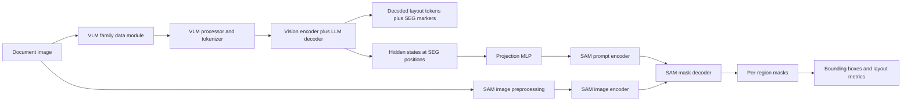

# Training Core

This is a modular multimodal document-understanding training stack built around a composite `VLM + SAM` model. It is designed for layout grounding workloads where the vision-language model predicts structure tokens and the segmentation head turns those structure cues into masks and bounding boxes.

The repository currently focuses on:

- single-node and multi-node training with `torchrun` and DeepSpeed ZeRO-3
- registry-based dataset onboarding
- family-owned VLM prompt construction and batching
- swappable vision encoder infrastructure with a 10-kind registry
- SAM-based mask supervision and decoding
- validation-time visualization and detection-style metrics

The checked-in code is real research code rather than a polished package. The docs below are written to match the current repository state, including a few hard-coded infrastructure assumptions and a partially experimental inference path.

## Modular Upgrade Status

The modular VLM + SAM upgrade is complete for the core model, encoder, and swap infrastructure.

- The existing Qwen path is available through both `qwenvl` and `qwenvlm`.
- `gemmavlm` is registered as a first-class `Gemma3` VLM family with a family-owned datamodule and wrapper.
- `molmovlm` is registered as a first-class Molmo family supporting all three variants: `allenai/Molmo-7B-D-0924` (Qwen2 backbone), `allenai/Molmo-7B-O-0924` (OLMo backbone), and `allenai/MolmoE-1B-0924` (OLMo-1B MoE). The processor requires `trust_remote_code=True`.
- `sam1` is registered through a SAM datamodule/model split.
- The generalized composite model lives at [training_core/models/vlm_sam.py](../training_core/models/vlm_sam.py).
- The current training config uses `vlm_family`, `sam_version`, `sam_checkpoint`, and optional `attn_implementation`.
- `train.py` now auto-loads `/code/api_keys/wandb_key` when `report_to` includes `wandb` and `WANDB_API_KEY` is not already exported.
- Vision encoder infrastructure is complete: `VisionEncoderBase`, `VisionEncoderRegistry`, and 10 registered encoder kinds (`native`, `clip`, `siglip`, `siglip2`, `metaclip`, `metaclip2`, `openvision`, `openvision2`, `extracted`, and the Molmo-specific `MolmoVisionBackboneAdapter` adapter path).
- Three builder scripts are complete: `extract_vision_encoder`, `swap_vision_encoder`, and `build_vlm_sam`.
- The encoder×decoder swap matrix is validated: 80/80 jobs passing (4 decoders × 10 encoders × 2 modes), with W&B logging and a full results report in [encoder_swap_matrix_report.md](../docs/reports/encoder_swap_matrix_report.md).
- VLM-only training is supported via `sam_version: none` in the training config. Set this flag to skip the SAM head entirely and train on CE loss only — no SAM checkpoint required. The `VLMOnly` model exposes `.backbone` identically to `VLMSam`, so all encoder swap functionality works unchanged. Validated smoke results: Qwen2.5-VL `train_loss=2.954`, Gemma3 `train_loss=2.687`, Molmo-7B-O `train_loss=5.144`, Qwen2.5-VL + SigLIP swap `train_loss=3.106`. The 80/80 encoder×decoder matrix passes with no regressions in either SAM or VLM-only mode.
- The dataset registry now covers **46 keys** across three packages: `datasets/layout/` (13 document-layout datasets), `datasets/pixmo/` (10 allenai/pixmo-* datasets), and `datasets/public/` (23 academic/benchmark datasets). All datasets share a unified `AnnotationSpec` contract. See [Dataset Registry](#dataset-registry) below.
- Dataset mixing is supported via a `datasets.mixing` config block. Strategies: `concat` (default, backward-compatible), `weighted` (proportional weighted sampling), `stratified` (tracks counts, samples most under-represented). Map-style and iterable/streaming datasets are handled separately.
- **Inference pipeline standardization:** `InferenceRunner` and `InferenceResult` contracts created for agnostic text and mask generation across all supported VLMs. Rebuilt `fastapi.py` serving endpoint to utilize the robust pipeline, successfully generalizing it to handle both mask-supervised layout models and generic text-only models (like captioning) without crashing on missing layout components.
- **Multi-node generation hardening:** Eliminated DeepSpeed ZeRO-3 deadlocks in generative callbacks by retaining non-zero ranks through the pipeline, gathering results back to rank 0 via `all_gather_object`. Introduced `DistributedSampler` chunking for massive validation speedups. `MolmoModel.generate()` now runs a self-contained manual autoregressive decode loop that calls the model's forward pass directly every step, completely bypassing `HF GenerationMixin.generate()` — under ZeRO-3 the wrapped model's forward signature drops Molmo-specific kwargs (`images`, `image_masks`, `image_input_idx`), which made `_validate_model_kwargs` raise a `ValueError` on every rank before any token was generated. Supports optional KV cache, greedy/multinomial sampling, EOS-aware pad-filling, and `synced_gpus` straggler protection.
- **Molmo pretraining stability fix:** Lowered the vision-backbone connector LR in `configs/mn_molmo_pretrain.yaml` from `2e-4` to `2e-5` (previously 10x the LLM trunk's LR), which was producing gradient-norm spikes above 40 during multi-node pretraining.
- **Molmo label-masking fix:** `tokenize_molmo_instance`'s prompt/loss-mask boundary is now computed by searching for the `" Assistant:"` role marker inside the image-conditioned token sequence itself, rather than comparing against a separately (no-image) tokenized prompt fragment. The previous boundary left most of the image-patch tokens and the literal `"User:"/"Assistant:"` role-marker text as real, supervised training targets — see [CHANGELOG.md](../CHANGELOG.md) for the full writeup.
- Real Docker tests cover Qwen, Gemma3, and Molmo checkpoints, including opt-in GPU smoke tests, trainer-level GPU smoke, 2-GPU DDP smoke, and 2-GPU single-process `DataParallel` smoke.
- Real Docker trainer smokes cover a streamed real-data `DocLayNet v1.2` subset for both `Qwen2.5-VL + SAM1` and `Gemma3 + SAM1`, including validation-image writes to disk.
- `VLMSam.generate()` restores the legacy text-plus-mask composite inference contract for both real `Qwen2-VL` and real `Gemma3` checkpoints, with dedicated composite tests.
- Real model execution in the checked-in pytest suite is GPU-only. CPU lanes are limited to contracts, data modules/processors, SAM mask utilities, and stubbed composite paths.
- The test suite is organized by layer under `tests/contracts`, `tests/data`, `tests/model`, `tests/composite`, and `tests/trainer`, with shared matrix helpers under `tests/support`.
- Phase progress, done items, and next TODOs are tracked in [CHANGELOG.md](../CHANGELOG.md).

Remaining TODOs:

- `sam2`/`sam3` versioned data/model paths
- Distinct `openvision2` checkpoint (currently shares the `openvision` hub path)
- Organize `datasets/public/` into domain subfolders (`vqa/`, `document/`, `science/`, `chart/`)
- Task-wise metric monitoring (ComputeMetrics dispatch per dataset type)

## Dataset Registry

The registry currently covers 47 dataset keys importable from `img_2_svg_pretraining.training.training_core.datasets`.

<details>
<summary><b>Full list of 47 dataset keys, mixing config, and coordinate normalization</b></summary>

### Layout (`datasets/layout/` — 13 keys)
Document layout segmentation datasets. `AnnotationSpec(has_localization=True, localization_type="bbox")`. Work with both `sam_version: sam1` (mask-supervised) and `sam_version: none` (autoregressive bbox prediction).

`doclaynet`, `publaynet`, `indicdlp`, `d4la`, `m6doc`, `docsyn`, `annopage`, `prima`, `omnidocs`, `comp_hr`, `custom_prompt`, `docbank`, `promptable_v1`

### PixMo (`datasets/pixmo/` — 11 keys)
AllenAI PixMo datasets from HuggingFace Hub. Pointing/counting datasets use `AnnotationSpec(has_localization=True, localization_type="point")` with Molmo `<point x=".." y=".." alt=".."/>` token format. Captioning/QA use `has_localization=False`.

`pixmo_cap`, `pixmo_cap_local`, `pixmo_cap_qa`, `pixmo_ask_model_anything`, `pixmo_points`, `pixmo_count`, `pixmo_point_explanations`, `pixmo_docs_charts`, `pixmo_docs_diagrams`, `pixmo_docs_tables`, `pixmo_docs_other`

**`pixmo_cap_local`** — locally downloaded PixMo-Cap (images + JSON at `/fsxvision_new/pratyush.jena/Datasets/pixmo-cap-images/extracted_dataset`). Kwargs: `data_path`, `mode` (`"captions"` | `"transcripts"` | `"transcript_and_caption"`), `shards` (subset list), `sample_limit`.

### Public / Academic (`datasets/public/` — 23 keys)
HF-hosted (streamable): `chartqa`, `textvqa`, `docvqa`, `vqa2`, `okvqa`, `aokvqa`, `scienceqa`, `infovqa`, `mathvista`, `realworldqa`, `mmmu`, `ai2d`, `vsr`

Local-download (requires `data_path` kwarg + `download()` helper): `dvqa`, `tallyqa`, `plotqa`, `figureqa`, `tabwmp`, `scenetextqa`, `countbenchqa`, `clockbench`, `vizwiz`, `hateful_memes` (DUA-gated)

### Mixing config
```yaml
datasets:
  train:
    - name: doclaynet
      weight: 3.0
    - name: pixmo_cap
      weight: 1.0
  mixing:
    strategy: weighted   # concat (default) | weighted | stratified
    seed: 42
```

### Coordinate normalization
All datasets output canonical `[0, 1]` float coordinates (bounding boxes as `xyxy`, points as `(x, y)`). VLM-family serializers and format converters are in `img_2_svg_pretraining.training.training_core.datasets.normalization`.

</details>

## Per-layer Learning Rates

Config-driven via `param_groups:` list. Each entry matches parameter names with a glob or regex pattern, sets `lr` and optionally `weight_decay`. Unmatched params fall to the global `learning_rate`. Activated in `CustomTrainer.create_optimizer` automatically when the list is non-empty.

```yaml
learning_rate: 5.0e-6  # default / fallback for unmatched params
param_groups:
  - pattern: "backbone.vision_model.*"
    lr: 2.0e-6
    weight_decay: 0.0
  - pattern: "backbone.multi_modal_projector.*"
    lr: 1.0e-5
    weight_decay: 0.01
  - pattern: "backbone.language_model.*"
    lr: 5.0e-6
    weight_decay: 0.01
```

## Captioning Eval Callback

`GenerativeEvalCallback` runs `model.generate()` on a fixed random subset of the val set and logs BLEU-4 + a W&B examples table. Enabled by adding `captioning_eval:` to the config:

```yaml
captioning_eval:
  eval_steps: 500       # run every N global steps (default: every eval)
  num_samples: 64       # fixed val subset size
  max_new_tokens: 256
```

Requires `sacrebleu` (`pip install sacrebleu`). W&B logging is optional — falls back to INFO logs if W&B is not active.

## Training Monitoring

### TrainingEfficiencyCallback

Registered automatically on every training run — no config required. Logs to W&B under the `efficiency/` namespace every step (after a 5-step warm-up, 50-step rolling average):

| Metric | What it measures |
|---|---|
| `step_time_ms` | Wall-clock ms per optimizer step |
| `steps_per_sec` | Optimizer steps per second |
| `samples_per_sec` | Samples/s across all GPUs |
| `data_stall_ms` | Time between step end and next step begin (≈ dataloader fetch) |
| `text_tokens_per_sec[_per_gpu]` | `input_ids` tokens/s |
| `active_tokens_per_sec[_per_gpu]` | Loss-contributing tokens/s (`labels != -100`) |
| `visual_tokens_per_sec` | Encoder output tokens/s |
| `encoder_time_ms` / `encoder_time_fraction` | Time inside vision encoder forward (including gradient-checkpointing recompute) as an absolute and as a fraction of step time |
| `peak_gpu_mem_gb` | Peak GPU memory this step (max across all ranks) |
| `mfu` / `mfu_pct` | Model FLOP Utilization via 6ND approximation; requires a recognized GPU (A100, H100, …); silently omitted otherwise |

The encoder is auto-discovered by walking common backbone attribute paths (`backbone.vision_encoder`, `backbone.visual`, `backbone.vision_backbone`, `backbone.vision_tower`). The MFU calculation uses `p.ds_numel` for ZeRO-3 sharded parameters so it reports the correct full parameter count.

### ProfilingCallback

Opt-in profiling for diagnosing step-level bottlenecks. Enable via a `profiling:` block in the training config:

```yaml
profiling:
  enabled: true
  wait_steps: 1      # steps to skip before recording
  warmup_steps: 1    # profiler warm-up steps
  active_steps: 3    # steps to record and export
  with_stack: false  # include Python stack traces (slower, better flame graphs)
  nvtx: true         # register NVTX range markers on key submodules
  output_dir: null   # defaults to {logging_dir}/profiler_traces
```

**torch.profiler trace (TensorBoard):**

The trace is written to `output_dir` from rank 0 after `wait + warmup + active` steps. Open with:

```bash
tensorboard --logdir outputs/<run_name>/profiler_traces
```

Navigate to the "PyTorch Profiler" tab to see per-op breakdowns, CUDA kernel timelines, memory consumption, and NCCL communication events.

**NVTX markers (Nsight Systems):**

NVTX hooks are registered on all ranks, so the full multi-GPU timeline is annotated. Three ranges are emitted per step: `training_step` (from `CustomTrainer`, always-on), `backbone_forward`, and `encoder_forward`. Launch with:

```bash
nsys profile \
  --trace cuda,nvtx,osrt \
  --cuda-memory-usage true \
  --output ./nsys_profile \
  torchrun --nproc_per_node 8 -m img_2_svg_pretraining.training.training_core.train.train
```

Open the resulting `.nsys-rep` in Nsight Systems GUI. The NVTX bands show encoder vs. LLM compute time on each GPU's timeline; gaps between CUDA kernels are NCCL communication bubbles.

> **When to use which tool:** `TrainingEfficiencyCallback` is always-on and gives continuous throughput metrics across the full run. `ProfilingCallback` is a one-shot diagnostic — use it when you need to see per-op breakdowns or identify why a specific combination is slower than expected.

## Documentation

- onboarding and first run: [QUICKSTART.md](../QUICKSTART.md)
- architecture diagram and references: [docs/diagrams/system-architecture.md](../docs/diagrams/system-architecture.md)
- training pipeline diagram: [docs/diagrams/training-flow.md](../docs/diagrams/training-flow.md)
- runtime topology diagrams: [docs/diagrams/runtime-topology.md](../docs/diagrams/runtime-topology.md)
- encoder swap matrix results: [encoder_swap_matrix_report.md](../docs/reports/encoder_swap_matrix_report.md)

### Rendered diagrams


## What The Model Does

At a high level, the training loop teaches a registered VLM backbone to emit layout tags and `[SEG]` markers. Hidden states at those `[SEG]` positions are projected into SAM prompt embeddings, and SAM decodes one mask per predicted segment.



More diagrams live in [docs/diagrams/system-architecture.md](../docs/diagrams/system-architecture.md), [training-flow.md](../docs/diagrams/training-flow.md), and [runtime-topology.md](../docs/diagrams/runtime-topology.md).

## Repository Layout

```text
training/
├── docker/                         # Container image and multi-node bootstrap (init_multinode_docker.sh)
├── docs/diagrams/                  # Architecture and runtime diagrams
├── docs/reports/                   # Matrix / smoke-test result reports
├── scripts/
│   ├── encoder_swap/               # One .sh launch script per config under configs/encoder_swap/
│   ├── archive/                    # Superseded launchers (launch_qwen.sh, mn_launch_qwen.sh, ...)
│   ├── adhoc/                      # One-off debug/inspection scripts, not part of the test suite
│   ├── run_encoder_swap_matrix.py  # 80-job encoder x decoder matrix runner
│   ├── run_parallel_test_matrix.py
│   ├── run_test_suite.py
│   ├── discover_test_checkpoints.py
│   ├── render_diagrams.sh
│   └── setup_test_env.sh
├── configs/
│   ├── encoder_swap/               # One YAML per decoder x encoder x mode combination
│   ├── smoke/encoder_swap/         # max_steps=200 variants of the above, for fast iteration
│   ├── deepspeed/                  # ZeRO configs
│   └── archive/                    # Superseded configs (run_pramana.yaml, ...)
├── training_core/
│   ├── builders/                   # extract_vision_encoder, swap_vision_encoder, build_vlm_sam
│   ├── data_modules/               # VLM and SAM family-specific processors and collators
│   ├── datasets/                   # Dataset adapters registered by name
│   ├── inference/                  # Validation/inference helpers
│   ├── matrix/                     # encoder_swap_matrix.py (MatrixRunSpec, ENCODER_SPECS, DECODER_SPECS)
│   ├── models/                     # VLM wrappers, SAM wrappers, and VLMSam composite
│   ├── registry/                   # Dataset, datamodule, and vision encoder registries
│   ├── train/                      # Training entrypoint and custom Trainer
│   ├── validation/                 # Metrics, visualization, and mAP helpers
│   └── vision_encoders/            # clip, siglip, metaclip, openvision, extracted
├── tests/{contracts,data,model,composite,trainer,support}/
├── outputs/                        # Checkpoints, eval artifacts, debug images
├── src/logs/                       # Training logs written by launch scripts
└── api_keys/                       # Local secrets: hf_token, wandb_key
```

## Core Components

### 1. Composite model

- [training_core/models/vlm_sam.py](../training_core/models/vlm_sam.py) builds `VLMSam`, a generalized `transformers.PreTrainedModel`.
- The Qwen side lives in [training_core/models/vlms/qwen/qwen_model.py](../training_core/models/vlms/qwen/qwen_model.py).
- The Gemma side lives in [training_core/models/vlms/gemma/gemma_model.py](../training_core/models/vlms/gemma/gemma_model.py).
- The Molmo side lives in [training_core/models/vlms/molmo/molmo_model.py](../training_core/models/vlms/molmo/molmo_model.py).
- The SAM side lives in [training_core/models/sam/sam1/sam1_model.py](../training_core/models/sam/sam1/sam1_model.py).
- A small projection MLP maps VLM hidden states at `[SEG]` positions into the SAM prompt embedding space.

### 2. Registry-based extensibility

- Dataset factories register through `DatasetRegistry.register_dataset(...)`.
- Model-specific data modules register through `DataModuleRegistry.register_module(...)`.
- Vision encoders register through `VisionEncoderRegistry.register(...)`.
- The registries live in [training_core/registry/registry.py](../training_core/registry/registry.py).
- Shared config dataclasses such as `DataArguments`, `DataModule`, and `ModelConfig` live in [training_core/registry/utils.py](../training_core/registry/utils.py).

### 3. Training loop

- The main training entrypoint is [training_core/train/train.py](../training_core/train/train.py).
- It loads whatever config `TRAINING_CONFIG` points to (e.g. one of `configs/encoder_swap/*.yaml`), builds one or more registered datasets, constructs `VLMSam` or `VLMOnly`, and launches Hugging Face `TrainingArguments` through a custom trainer.
- [training_core/train/custom_trainer.py](../training_core/train/custom_trainer.py) intercepts validation to save visualizations and compute detection-style metrics from masks.

### 4. Validation and outputs

- [training_core/validation/compute_metrics.py](../training_core/validation/compute_metrics.py) converts masks to per-class detections and computes mAP-like metrics.
- Validation visualizations are written under the run-specific `logging_dir`.
- Final checkpoints are written under the configured `output_dir`, with `final/` saved after training.

### 5. Vision encoder registry and encoder swap

The vision encoder subsystem is a standalone registry layer that sits between the raw VLM internal backbone and the model assembly step.

**`VisionEncoderRegistry`** is a sixth registry alongside the five existing ones. It exposes `register(name)` and `get_encoder(name, checkpoint)` and is populated by the encoder family modules.

**10 registered encoder kinds:**

| Kind | Class | Notes |
|---|---|---|
| `native` | VLM-internal backbone | no swap, default path |
| `clip` | `CLIPVisionEncoder` | wraps `transformers.CLIPVisionModel` |
| `siglip` | `SigLIPVisionEncoder` | wraps `SiglipVisionModel` |
| `siglip2` | `SigLIP2VisionEncoder` | wraps `Siglip2VisionModel` (separate HF class) |
| `metaclip` | `MetaCLIPVisionEncoder` | wraps `CLIPVisionModel` for MetaCLIP v1 checkpoints |
| `metaclip2` | `MetaCLIPVisionEncoder` | MetaCLIP v2 (worldwide-huge-quickgelu) |
| `openvision` | `OpenVisionEncoder` | wraps `open_clip` UCSC-VLAA collection; requires `open_clip_torch` |
| `openvision2` | `OpenVisionEncoder` | OpenVision v2; requires `open_clip_torch` |
| `extracted` | `ExtractedVisionEncoder` | loads a VLM-extracted backbone from `weights.pt` + `preprocessor.json` |
| Molmo adapter | `MolmoVisionBackboneAdapter` | family-specific path for Molmo decoders; wraps new encoder + original `image_projector` |

**`ExtractedVisionEncoder`** wraps an `nn.Module` detached from a trained VLM. It supports a `save(dir)` / `from_saved(dir)` round-trip, enabling cross-family encoder reuse (e.g., using Molmo-7B-D's vision backbone inside Qwen-VL).

**`MolmoVisionBackboneAdapter`** handles the Molmo-specific swap path: it wraps the incoming encoder alongside the original Molmo `image_projector` and routes non-native encoders through `_molmo_patchify_images` so the OLMo backbone receives correctly shaped patch tensors.

**Three builder scripts** wire the above into a usable assembly flow:

- `extract_vision_encoder` — loads a VLM, detaches its vision module, saves it as an `ExtractedVisionEncoder` under `output_dir/encoder_name/`. CLI: `python -m img_2_svg_pretraining.training.training_core.builders.extract_vision_encoder`.
- `swap_vision_encoder` — replaces the VLM-internal vision backbone with any registered `VisionEncoderBase`. When `new_encoder.embed_dim != projector.in_features`, automatically inserts `nn.Linear(new_dim, original_dim)` stored as `vlm_wrapper.vision_adapter`. CLI: via `build_vlm_sam` or direct import.
- `build_vlm_sam` — one-call composite constructor: builds `VLMSam` + `DataModule`, then optionally swaps the encoder if `vision_encoder` + `vision_encoder_checkpoint` are provided. CLI: `python -m img_2_svg_pretraining.training.training_core.builders.build_vlm_sam`.

## Encoder×Decoder Swap Matrix

The encoder×decoder swap matrix validates every combination of registered VLM decoder and vision encoder. As of v0.4.0, all 80 jobs pass.

**Matrix dimensions:**

- 4 decoders: `qwenvlm`, `gemmavlm`, `molmo7b-d`, `molmo7b-o`
- 10 encoders: `native`, `clip`, `siglip`, `siglip2`, `metaclip`, `metaclip2`, `openvision`, `openvision2`, `extracted-molmo7bd`, `extracted-molmo7bo`
- 2 modes: forward-only smoke, forward + loss check
- Total: 80 jobs

**Running the matrix:**

```bash
# Full 80-job matrix with W&B logging
python scripts/run_encoder_swap_matrix.py --report-to wandb

# Subset: clip and siglip encoders against molmo7b-d only
python scripts/run_encoder_swap_matrix.py --encoders clip,siglip --decoders molmo7b-d
```

**Results:**

- Per-job logs and CSV summary: `outputs/encoder_swap_matrix/`
- Full report: [encoder_swap_matrix_report.md](../docs/reports/encoder_swap_matrix_report.md)
- W&B project: `img-2-svg-pretraining-encoder-swap-matrix`

**Prerequisites:**

- `open_clip_torch>=3.3.0` for `openvision`/`openvision2` jobs
- Pre-extracted encoder directories for `extracted` kind jobs (use `extract_vision_encoder` builder first)

## Supported Dataset Adapters

<details>
<summary><b>List of layout dataset adapters and what each one is responsible for</b></summary>

The repository already includes adapters for:

- `annopage`
- `comp_hr`
- `custom_prompt`
- `d4la`
- `doc_bank`
- `doclaynet`
- `docsyn`
- `hierlay`
- `hierlay_v2`
- `indicdlp`
- `indicdlp_hier`
- `m6doc`
- `omni_docs`
- `prima`
- `promptable_v1`
- `publaynet`

These live under [training_core/datasets](../training_core/datasets). Each adapter is responsible for:

- loading or resolving the source dataset
- converting samples into family-compatible multimodal conversations
- providing SAM supervision data
- exposing a label extraction function for validation and metrics

</details>

## Environment Model

Every real run is launched through SLURM. The `#SBATCH`-annotated launch script itself builds/reuses a per-user Docker container on each allocated node (via [docker/init_multinode_docker.sh](../docker/init_multinode_docker.sh)) and runs `torchrun` inside it — there is no separate manual "start a container, then activate an env" step.

Fixed mounts inside that container:

- the repo is mounted at `/code`
- the shared filesystem (`/fsxvision_new`) is mounted at the same path
- the Hugging Face cache is mounted so checkpoints aren't re-downloaded per run
- training logs go to `/code/src/img_2_svg_pretraining/training/logs`, outputs/checkpoints to `/code/src/img_2_svg_pretraining/training/outputs`

Two files under `api_keys/` (git-ignored) drive auth:

- `api_keys/hf_token` — required for gated HF checkpoints (e.g. Gemma)
- `api_keys/wandb_key` — optional, enables W&B logging

The checked-in helper scripts are the canonical source for these assumptions:

- [docker/Dockerfile.multinode](../docker/Dockerfile.multinode)
- [docker/init_multinode_docker.sh](../docker/init_multinode_docker.sh)

## Launching A Run

Every run is one YAML config under `configs/encoder_swap/` (or `configs/smoke/encoder_swap/` for a fast 200-step smoke test) plus a matching `.sh` launch script under `scripts/encoder_swap/`, named identically. The script's `#SBATCH --nodes` controls how many nodes it requests (current scripts use 2 or 4 depending on model size).

```bash
sbatch --export=ALL,TRAINING_CONFIG=/code/src/img_2_svg_pretraining/training/configs/encoder_swap/mn_molmo_7b_veclip_raw_pt.yaml \
  scripts/encoder_swap/mn_molmo_7b_veclip_raw_pt.sh
```

The script reads `TRAINING_CONFIG` (falling back to its own hardcoded default matching its filename if unset), initializes the container on each node, and runs:

```bash
torchrun --nproc_per_node=<GPUS> --nnodes=<N> --node_rank=<R> \
  --master_addr=<addr> --master_port=<port> \
  -m img_2_svg_pretraining.training.training_core.train.train
```

Logs land at `src/logs/slurm_<name>_<job_id>.{out,err}` (SLURM stdout/stderr) and `src/logs/<name>_rank_<N>.log` (per-rank training log, teed from inside the container).

See **[QUICKSTART.md](../QUICKSTART.md)** for a full walkthrough with an annotated example config, including a vision-encoder swap.

## Configuration

There's no single canonical config file — every `configs/encoder_swap/*.yaml` is a complete, standalone run definition. Fields, grouped by block (see [QUICKSTART.md](../QUICKSTART.md) for one in full):

**Top-level**

| Field | Meaning |
|---|---|
| `vlm_family` | Registered VLM family: `qwenvlm`, `gemmavlm`, `molmovlm` |
| `base_model` | Base VLM checkpoint path or HF hub ID |
| `model_family_name` | Short family tag used by some dataset adapters (e.g. `molmo`) |
| `attn_implementation` | Optional backend override: `eager`, `sdpa`, `flash_attention_2` |
| `molmo_max_crops` | Molmo only — caps image crops per sample (default 12; lower to save memory) |
| `sam_version` | `none` for VLM-only (CE loss only, no SAM checkpoint needed) or a registered SAM version (e.g. `sam1`) |
| `out_dim` | Projection dim from VLM hidden states into the SAM prompt embedding space |
| `run_name` | Unique experiment name — used in `output_dir`, `logging_dir`, and W&B |
| `split_ratio` | Train/val split fraction for datasets without a native split |
| `seed` | Data shuffling / split seed |
| `wandb_project` | W&B project to log to (requires `trainer.report_to: wandb`) |
| `logging_dir` / `output_dir` | Where validation artifacts / checkpoints are written |

**`checkpoint`**

| Field | Meaning |
|---|---|
| `resume` | `false` for a fresh run, `true` to resume/load from `path` |
| `path` | Checkpoint directory (required if `resume: true`) |
| `mode` | `weights_only` (fresh optimizer/scheduler) or `full` (resumes optimizer + step count) |

**Vision-encoder swap** (both optional — omit for the VLM's native encoder)

| Field | Meaning |
|---|---|
| `vision_encoder` | Registered encoder kind: `clip`, `siglip`, `siglip2`, `metaclip`, `metaclip2`, `openvision`, `openvision2`, `extracted`, or `native` |
| `vision_encoder_checkpoint` | Path or HF hub ID for the encoder checkpoint; for `extracted`, the directory produced by the `extract_vision_encoder` builder |

**`pretrain_init`** (omit the whole block for a plain fine-tune that keeps the base model's existing connector and LLM)

| Field | Meaning |
|---|---|
| `ve_init_mode` | `none` (keep base model's ViT weights), `from_vlm`, or `swap_from_vlm` (extract a ViT from a different VLM checkpoint via `ve_source_vlm`) |
| `reset_connector` | Randomly re-initializes the vision→LLM projector — use when swapping to an encoder with a very different feature space |
| `lm_init_mode` | `from_vlm` (keep the base model's LLM weights) or `raw_llm` (replace with `lm_checkpoint`) |
| `lm_checkpoint` | HF ID/path for the raw LLM checkpoint when `lm_init_mode: raw_llm` (e.g. `allenai/OLMo-7B-1024-preview`) |

**`param_groups`** (optional — per-layer learning rates; see [Per-layer Learning Rates](#per-layer-learning-rates) above)

**`trainer`** — passed almost directly to HF `TrainingArguments`

| Field | Meaning |
|---|---|
| `deepspeed` | Path to a DeepSpeed JSON config (e.g. `configs/deepspeed/zero3.json`) |
| `num_train_epochs` / `max_steps` | Training length — `max_steps` overrides epochs when set (used by smoke configs) |
| `per_device_train_batch_size` / `per_device_eval_batch_size` | Per-GPU batch sizes |
| `gradient_accumulation_steps` | Micro-batches accumulated before an optimizer step |
| `eval_strategy` / `eval_steps` | When to run HF's built-in eval loop (computes `eval_loss`) |
| `save_strategy` / `save_steps` / `save_total_limit` | Checkpoint cadence and retention |
| `learning_rate` / `lr_scheduler_type` / `lr_scheduler_kwargs` / `warmup_steps` | LR schedule (fallback for params not matched by `param_groups`) |
| `weight_decay` / `max_grad_norm` | Regularization / gradient clipping |
| `optim`, `adam_beta1`, `adam_beta2`, `adam_epsilon` | Optimizer selection and hyperparameters |
| `bf16` | Mixed-precision training |
| `gradient_checkpointing` | Trade compute for memory |
| `logging_steps` | W&B/console logging cadence |
| `dataloader_num_workers` | PyTorch `DataLoader` worker count |
| `report_to` | `"wandb"` to enable W&B logging |

**`loss`**

| Field | Meaning |
|---|---|
| `ce_loss_weight` | Weight on the language-model cross-entropy loss (SAM configs also set `bce_loss_weight`/`dice_loss_weight`) |

**`datasets`**

| Field | Meaning |
|---|---|
| `train[]` / `val[]` | Lists of `{name, dataset_kwargs}` — `name` must be a registered dataset key (see [Dataset Registry](#dataset-registry)) |
| `train[].weight` | Sampling weight, used when `mixing.strategy` is `weighted` or `stratified` |
| `mixing.strategy` | `concat` (default), `weighted`, or `stratified` — see [Dataset Registry § Mixing config](#dataset-registry) |

**`captioning_eval`** (optional — omit to skip generation-based eval entirely)

| Field | Meaning |
|---|---|
| `eval_steps` | Run every N global steps (independent of `trainer.eval_steps`) |
| `num_samples` | Fixed random val subset size to generate on |
| `max_new_tokens` | Generation budget per sample |
| `do_sample` | `false` for greedy decoding, `true` to enable `temperature`-based sampling |

Currently validated `vlm_family` values: `qwenvlm`, `gemmavlm`, `molmovlm`.

## Training Data Flow

The training path looks like this:

1. `train.py` reads the config pointed to by the `TRAINING_CONFIG` env var (set by the launch script from its `sbatch --export` argument), falling back to `configs/archive/run_pramana.yaml` if unset.
2. Each dataset name in `datasets.train` resolves through `DatasetRegistry`.
3. The selected VLM data module adds the `[SEG]` token, processor, collator, and any family-specific positional handling.
4. Dataset adapters produce both:
   - a VLM-ready multimodal conversation sample
   - a SAM supervision bundle with masks, resized image tensors, and original dimensions
5. If `vision_encoder` is set in config, `build_vlm_sam` calls `swap_vision_encoder` after composite construction. A `vision_adapter` (`nn.Linear`) is inserted automatically when dims differ.
6. `VLMSam.forward(...)` computes:
   - language loss from the active VLM backbone
   - mask losses from the SAM decoder
7. `CustomTrainer` runs validation and writes visual debug outputs.

See [docs/diagrams/training-flow.md](../docs/diagrams/training-flow.md) for the diagrammed version.

## Inference Status

There is an inference helper in [training_core/inference/fastapi.py](../training_core/inference/fastapi.py), and the core model-side `VLMSam.generate()` contract is restored for text-plus-mask generation. The checked-in inference utilities now import from the local [training_core/inference](../training_core/inference) package rather than stale missing modules, and they build the active VLM family plus SAM version through the same registered path used by training.

That means:

- validation-time generation helpers are now self-contained in the repository and the composite model supports the legacy `preds, pred_masks = model.generate(...)` contract again
- single-image inference code now routes through registered `vlm_family` and `sam_version` builders for the checked-in families
- prompt-only generation inputs are derived from labels in a family-agnostic way, so Qwen and Gemma inference follow the same truncation contract

The inference package is still experimental in the broader serving sense because the example entrypoints and paths are infrastructure-specific, but the checked-in inference flow is no longer hardwired to the old Qwen-only utility path.

## Outputs You Should Expect

During a normal training run:

- logs are written to `logs/train_<timestamp>.log`
- validation images are written under `outputs/<run_name>/validation_steps/...`
- checkpoints are written under `outputs/<run_name>/checkpoints/...`
- the final exported model is written to `<output_dir>/final`

Validated real-data smoke outputs now include:

- `outputs/smoke_real_data_doclaynet_qwen25_sam1/validation_steps/smoke_real_data_doclaynet_qwen25_sam1/1/0/*.png`
- `outputs/smoke_real_data_doclaynet_gemma3_sam1/validation_steps/smoke_real_data_doclaynet_gemma3_sam1/1/0/*.png`

During validation or offline generation helpers:

- per-image visualizations
- saved prediction masks
- saved ground-truth masks
- JSON detections with predicted labels and boxes

## Extending The Repo

### Add a new dataset

1. Create a new adapter under `training_core/datasets/`.
2. Register it with `@DatasetRegistry.register_dataset("your_name")`.
3. Return a `DataArguments` object with:
   - the dataset
   - a VLM conversation formatter
   - SAM supervision formatter arguments
   - a label extraction function
4. Add the dataset name to `datasets.train`/`datasets.val` in your config (see [Configuration](#configuration)).

### Add a new VLM family or processor path

1. Add a family-owned data module under `training_core/data_modules/vlms/`.
2. Add a model wrapper under `training_core/models/vlms/`.
3. Register them with `DataModuleRegistry` and `VLMModelRegistry`.
4. Ensure the family provides:
   - a processor
   - tokenizer changes such as `[SEG]`
   - a dataset wrapper
   - a collator
   - model-specific positional indexing if needed

### Add a new vision encoder kind

1. Add an encoder class under `training_core/vision_encoders/` that extends `VisionEncoderBase`.
2. Implement `embed_dim` and `preprocessor_config` abstract properties.
3. Register with `@VisionEncoderRegistry.register("your_kind")`.
4. Add a corresponding `EncoderSpec` to `ENCODER_SPECS` in `training_core/matrix/encoder_swap_matrix.py` if you want it included in matrix runs.

## Troubleshooting

<details>
<summary><b>Common failure modes and fixes</b></summary>

**Gated checkpoint download fails (e.g. Gemma)**
Make sure `api_keys/hf_token` exists and contains a valid token with access to the gated model — `docker/init_multinode_docker.sh` reads it and exports `HF_TOKEN` inside the container.

**W&B logging is failing**
Check that `/code/api_keys/wandb_key` exists, contains only the token, and that `report_to: "wandb"` is still enabled in the config.

**DeepSpeed or memory issues**
Lower batch sizes, reduce `NPROC_PER_NODE`, disable `trainer.deepspeed` for debug runs, or lower eval frequency.

**Dataset path or checkpoint path failures**
The repo contains several environment-specific absolute paths. If a run fails early, inspect `checkpoint.path`, `val_checkpoint`, `val_output_dir`, and dataset-specific adapter defaults under `training_core/datasets/`.

**OpenVision encoder jobs failing with `ImportError`**
Install the optional dependency: `pip install open_clip_torch>=3.3.0`.

**Extracted encoder jobs failing with a missing directory**
Run the `extract_vision_encoder` builder for the relevant VLM family first — see [Three builder scripts](#2-registry-based-extensibility) above.

</details>

## Known Gaps And Caveats

<details>
<summary><b>Hard-coded assumptions, TODOs, and other caveats</b></summary>

- Several paths are still hard-coded to local or cluster-specific locations, especially checkpoint and dataset paths.
- The old project name `DocGrounding` still appears in some scripts, comments, and paths.
- `gemmavlm` currently expects a chat-template-capable `Gemma3` checkpoint.
- Molmo requires `trust_remote_code=True` for both model loading and processor.
- `open_clip_torch` is an optional dependency required only for `openvision`/`openvision2` encoders. Install `open_clip_torch>=3.3.0` separately.
- `sam2`/`sam3` are still TODO.
- The checked-in repo includes a source-level pytest suite under `tests/`.
- Single-node training/tests run inside this repo's existing `img-2-svg-pretraining-singlenode` container (see the repo root's `docker/`); only multi-node training has its own dedicated image (`docker/Dockerfile.multinode` + `docker/init_multinode_docker.sh`).
- `without_teacher_forcing` is still not checked in as a standalone package; production inference serving remains implementation guidance.

</details>

## Tests

<details>
<summary><b>Full test layout, runner commands, checkpoint env vars, and validated results</b></summary>

The modular restart uses a layer-based test matrix under `tests/`:

- `contracts`: registries, interface contracts, and `VLMSam` return-shape guarantees
- `data`: Qwen/Gemma/Molmo datamodules plus shared SAM batching/collation
- `model`: individual VLM wrappers, vision encoder smoke, and SAM model logic
- `composite`: `VLMSam` integration, including CPU-safe stub coverage and GPU-only real family-level checks
- `trainer`: representative single-GPU, DDP, and DataParallel training smokes for `Qwen2.5-VL + SAM1` and `Gemma3 + SAM1`
- `trainer` also includes a real-model eval-artifact regression test that asserts validation PNGs are written for both representative families

Shared matrix and helpers live in:

- [tests/support/matrix.py](../tests/support/matrix.py)
- [tests/support/builders.py](../tests/support/builders.py)
- [tests/support/runtime.py](../tests/support/runtime.py)

The canonical entrypoint is now [scripts/run_test_suite.py](../scripts/run_test_suite.py). It drives both local/Docker runs and GitHub Actions profiles, and performs checkpoint preflight before external suites start.

For full-node validation on the shared H100 host, the repo also includes
[scripts/run_parallel_test_matrix.py](../scripts/run_parallel_test_matrix.py).
It launches the full suite through a dynamic resource scheduler instead of a fixed phase barrier:

- CPU-only jobs start immediately and stay off the GPU pool
- single-GPU jobs are split into granular per-spec and per-subsystem tasks
- freed GPUs are reused immediately for the next pending 1-GPU job
- 2-GPU DDP and DataParallel jobs enter the queue as soon as two GPUs are available, even if other long single-GPU jobs are still running

The scheduler also exports a few throughput-oriented defaults for the matrix jobs:

- `HF_ENABLE_PARALLEL_LOADING=true`
- `HF_PARALLEL_LOADING_WORKERS`
- `OMP_NUM_THREADS`
- `MKL_NUM_THREADS`
- `NUMEXPR_NUM_THREADS`
- `TOKENIZERS_PARALLELISM=false`
- `PYTORCH_CUDA_ALLOC_CONF=expandable_segments:True`

Plain raw `pytest` runs now treat optional coverage as opt-in:

- `external`, `gpu`, `ddp`, and `dataparallel` tests are deselected by default
- those suites are enabled through the runner profiles, legacy env flags, or an explicit marker selection such as `-m external`
- this keeps the default developer loop clean and avoids "green because of skips" for optional heavyweight paths

Validated in Docker:

- CPU PR profile:
  `python scripts/run_test_suite.py --profile cpu-pr --pytest-args -vv`
- Result:
  `24 passed, 44 deselected`

- Representative GPU profile:
  `python scripts/run_test_suite.py --profile gpu-representative --pytest-args -vv`
- Result:
  `20 passed, 3 deselected, 2 warnings`

- Real-model eval-artifact regression:
  `python -m pytest -q tests/trainer/test_vlm_trainer_eval_artifacts.py -vv`
- Result:
  `2 passed`

- Dynamic full-node matrix on the shared 8x H100 host:
  `python3 scripts/run_parallel_test_matrix.py`
- Result:
  all `29` scheduled jobs passed with immediate GPU backfilling and mixed 1-GPU plus 2-GPU execution
- Green log bundle:
  [logs/test_matrix/20260519T202752Z](../logs/test_matrix/20260519T202752Z)

- Encoder×decoder swap matrix on the shared 8x H100 host:
  `python scripts/run_encoder_swap_matrix.py --report-to wandb`
- Result:
  `80/80 jobs passed`

- Real-data DocLayNet v1.2 smokes:
  `TRAINING_CONFIG_PATH=/code/src/img_2_svg_pretraining/training/configs/smoke/real_data_doclaynet_qwen25_sam1.yaml python -m img_2_svg_pretraining.training.training_core.train.train`
  and
  `TRAINING_CONFIG_PATH=/code/src/img_2_svg_pretraining/training/configs/smoke/real_data_doclaynet_gemma3_sam1.yaml python -m img_2_svg_pretraining.training.training_core.train.train`
- Result:
  both completed train + eval, wrote final checkpoints, and wrote validation PNGs for the eval step

CPU PR gate in Docker:

```bash
docker exec img-2-svg-pretraining-singlenode-venkat.kesav bash -lc '
  export HF_HOME=/tmp/training_hf_tests &&
  export HUGGINGFACE_HUB_CACHE=/tmp/training_hf_tests/hub &&
  source /environments/training_core/bin/activate &&
  cd /code/src/img_2_svg_pretraining/training &&
  PYTHONPATH=/code/src python scripts/run_test_suite.py --profile cpu-pr --pytest-args -vv
'
```

Representative GPU matrix in Docker:

```bash
docker exec img-2-svg-pretraining-singlenode-venkat.kesav bash -lc '
  export HF_HOME=/tmp/training_hf_tests &&
  export HUGGINGFACE_HUB_CACHE=/tmp/training_hf_tests/hub &&
  source /environments/training_core/bin/activate &&
  cd /code/src/img_2_svg_pretraining/training &&
  PYTHONPATH=/code/src python scripts/run_test_suite.py --profile gpu-representative --pytest-args -vv
'
```

Nightly/manual GPU matrix command:

```bash
docker exec img-2-svg-pretraining-singlenode-venkat.kesav bash -lc '
  export HF_HOME=/tmp/training_hf_tests &&
  export HUGGINGFACE_HUB_CACHE=/tmp/training_hf_tests/hub &&
  source /environments/training_core/bin/activate &&
  cd /code/src/img_2_svg_pretraining/training &&
  PYTHONPATH=/code/src python scripts/run_test_suite.py --profile gpu-nightly --pytest-args -vv
'
```

The runner currently understands these checkpoint env vars:

- `TRAINING_TEST_QWEN2_MODEL`
- `TRAINING_TEST_QWEN25_MODEL`
- `TRAINING_TEST_QWEN3_MODEL`
- `TRAINING_TEST_QWEN3_MOE_MODEL`
- `TRAINING_TEST_GEMMA3_MODEL`
- `TRAINING_TEST_MOLMO_D_MODEL`
- `TRAINING_TEST_MOLMO_O_MODEL`
- `TRAINING_TEST_MOLMO_1B_MODEL`
- `TRAINING_TEST_SAM1_CHECKPOINT`

To discover locally cached checkpoint paths for those env vars, use:

```bash
python scripts/discover_test_checkpoints.py
```

In the current environment that helper finds local paths for:

- `TRAINING_TEST_QWEN2_MODEL`
- `TRAINING_TEST_QWEN25_MODEL`
- `TRAINING_TEST_QWEN3_MODEL`
- `TRAINING_TEST_QWEN3_MOE_MODEL`
- `TRAINING_TEST_GEMMA3_MODEL`
- `TRAINING_TEST_SAM1_CHECKPOINT`

If you need to download gated Hugging Face checkpoints such as official `Gemma3`, keep the token in:

- `api_keys/hf_token`

That directory is already git-ignored. A typical container-side download flow is:

```bash
docker exec img-2-svg-pretraining-singlenode-venkat.kesav bash -lc '
  cd /code/src/img_2_svg_pretraining/training &&
  HF_TOKEN=$(cat /code/api_keys/hf_token) \
  HF_HOME=/fsxvision_new/anirudh.srinivasan/hf_cache \
  HUGGINGFACE_HUB_CACHE=/fsxvision_new/anirudh.srinivasan/hf_cache/hub \
  /environments/training_core/bin/python - <<\"PY\"
from huggingface_hub import snapshot_download
print(snapshot_download("google/gemma-3-4b-it", token=True, cache_dir="/fsxvision_new/anirudh.srinivasan/hf_cache/hub"))
PY
'
```

Coverage policy note:

- `Qwen2.5-VL + SAM1` and `Gemma3 + SAM1` stay as the representative default matrix
- larger `Qwen3` and `Qwen3-MoE` paths are intentionally manual/nightly inputs rather than always-on defaults

Multi-GPU caveat:

- Both `torchrun` / DDP and single-process `torch.nn.DataParallel` now pass the checked-in `Gemma3 + SAM1` smoke tests.
- Both also pass the representative `Qwen2.5-VL + SAM1` trainer smokes.
- `torchrun` / DDP is still the recommended training launch path for real runs.

Validated full-node matrix:

- `python3 scripts/run_parallel_test_matrix.py`
- Result:
  `43 passed`
- Latest green log bundle:
  [logs/test_matrix/20260519T152920Z](../logs/test_matrix/20260519T152920Z)

</details>

## CI

<details>
<summary><b>Workflow files and environment bootstrap</b></summary>

Hybrid CI is now checked in under `.github/workflows`:

- [ci-cpu.yml](../.github/workflows/ci-cpu.yml)
  runs the hosted CPU PR gate on GitHub Actions
- [ci-gpu.yml](../.github/workflows/ci-gpu.yml)
  targets self-hosted GPU runners for representative and nightly/manual matrices

The repo-owned environment bootstrap for CI is:

- [requirements-test.txt](../requirements-test.txt)
- [scripts/setup_test_env.sh](../scripts/setup_test_env.sh)

The setup script accepts both CPU and GPU Torch flavors:

- `bash scripts/setup_test_env.sh .venv-tests cpu`
- `bash scripts/setup_test_env.sh .venv-tests cu126`

</details>

## Recommended Reading Order

If you are new to the codebase, the fastest way in is:

1. [QUICKSTART.md](../QUICKSTART.md)
2. [configs/encoder_swap/mn_molmo_7b_veclip_raw_pt.yaml](../configs/encoder_swap/mn_molmo_7b_veclip_raw_pt.yaml)
3. [training_core/train/train.py](../training_core/train/train.py)
4. [training_core/models/vlm_sam.py](../training_core/models/vlm_sam.py)
5. [training_core/vision_encoders/extracted/extracted_encoder.py](../training_core/vision_encoders/extracted/extracted_encoder.py)
6. [docs/diagrams/system-architecture.md](../docs/diagrams/system-architecture.md)

## Quick Links

- Quick start: [QUICKSTART.md](../QUICKSTART.md)
- Example training config (with a vision-encoder swap): [configs/encoder_swap/mn_molmo_7b_veclip_raw_pt.yaml](../configs/encoder_swap/mn_molmo_7b_veclip_raw_pt.yaml)
- Matching launch script: [scripts/encoder_swap/mn_molmo_7b_veclip_raw_pt.sh](../scripts/encoder_swap/mn_molmo_7b_veclip_raw_pt.sh)
- Encoder swap matrix runner: [scripts/run_encoder_swap_matrix.py](../scripts/run_encoder_swap_matrix.py)
- Encoder swap matrix report: [encoder_swap_matrix_report.md](../docs/reports/encoder_swap_matrix_report.md)
- Registry notes: [training_core/registry/registry_readme.md](../training_core/registry/registry_readme.md)
