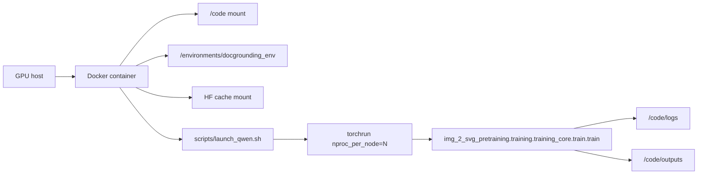
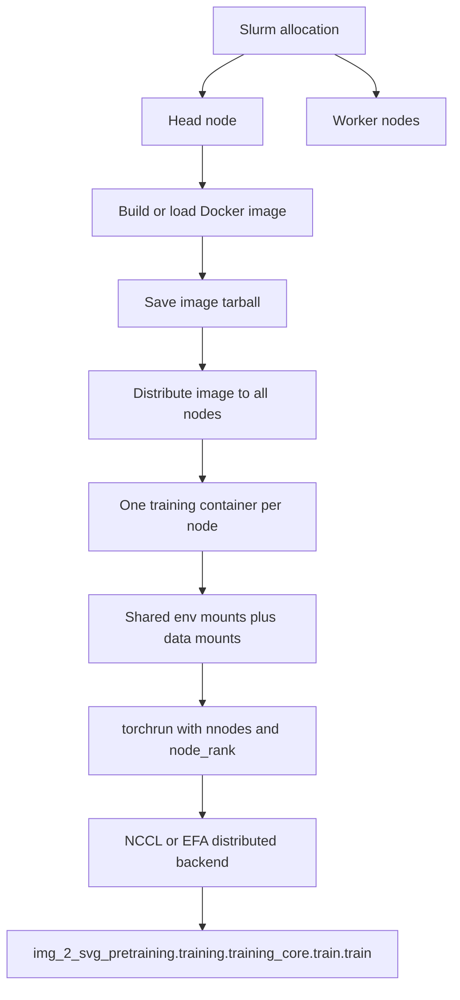
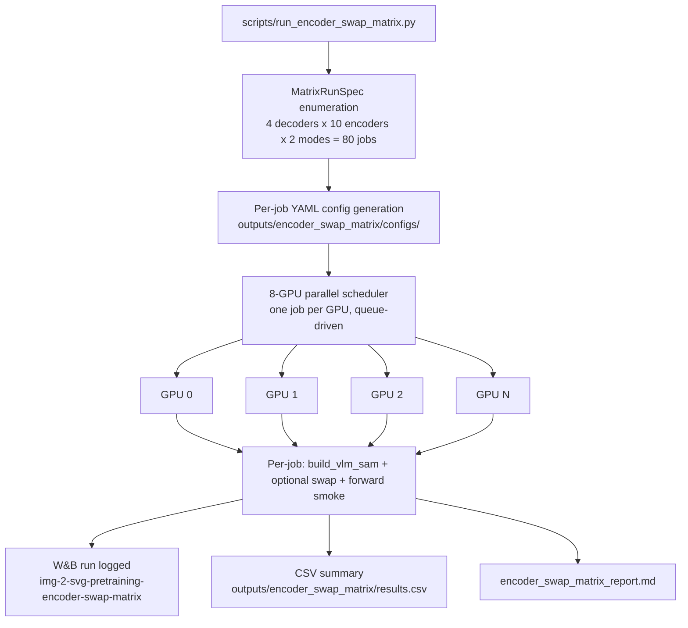

# Runtime Topology

These diagrams show how the repository is intended to run in single-node, multi-node, and encoder-swap matrix environments.

## Single-Node Topology





## Multi-Node Topology





## Encoder×Decoder Swap Matrix Runner

This topology covers the 80-job encoder×decoder matrix runner introduced in v0.4.0. It runs as a standalone parallel script rather than through `torchrun` or `train.py`.



Subset runs are supported via `--encoders` and `--decoders` flags:

```bash
# Full 80-job matrix with W&B logging
python scripts/run_encoder_swap_matrix.py --report-to wandb

# Subset: only clip and siglip encoders against molmo7b-d decoder
python scripts/run_encoder_swap_matrix.py --encoders clip,siglip --decoders molmo7b-d
```

## Operational Notes

- Single-node training is the most direct supported workflow in this repo snapshot.
- The multi-node launcher is cluster-specific and should be treated as an infrastructure template.
- Both single-node and multi-node paths assume `/code` and `/environments` style mounts and write outputs back to the mounted workspace.
- The encoder swap matrix runner requires `open_clip_torch` (version 3.3.0 or later) to be installed in the active environment for `openvision` and `openvision2` encoder jobs. All other encoder kinds work without it. Install with:
  `pip install open_clip_torch>=3.3.0`
- Extracted encoders (`extracted` kind) require pre-existing `extracted_encoders/<encoder_name>/` directories on disk, created beforehand via the `extract_vision_encoder` builder:
  `python -m img_2_svg_pretraining.training.training_core.builders.extract_vision_encoder --vlm_family molmovlm --vlm_checkpoint <path> --encoder_name extracted-molmo7bd --output_dir extracted_encoders/`

Relevant files:

- [scripts/launch_qwen.sh](../scripts/launch_qwen.sh)
- [scripts/mn_launch_qwen.sh](../scripts/mn_launch_qwen.sh)
- [scripts/run_encoder_swap_matrix.py](../scripts/run_encoder_swap_matrix.py)
- [training_core/matrix/encoder_swap_matrix.py](../training_core/matrix/encoder_swap_matrix.py)
- [docker/init_multinode_docker.sh](../docker/init_multinode_docker.sh)
