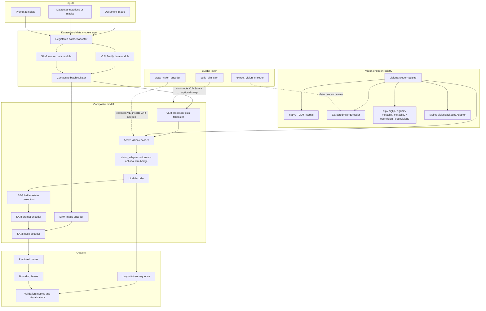

# System Architecture

This diagram shows the main training and inference building blocks in the training stack and how data moves between them. The vision encoder is now a swappable registry component, decoupled from the VLM-internal backbone path.

## Notes

- `VisionEncoderRegistry` is a distinct sixth registry alongside `DatasetRegistry`, `DataModuleRegistry`, `VLMModelRegistry`, `SAMDataModuleRegistry`, and `SAMModelRegistry`.
- The `native` encoder kind means the VLM-internal vision backbone is used unchanged (no swap).
- `ExtractedVisionEncoder` wraps an `nn.Module` detached from a trained VLM and saved to disk via `extract_vision_encoder`. It is reloaded from `weights.pt` + `preprocessor.json`.
- `MolmoVisionBackboneAdapter` handles cross-encoder swaps for Molmo decoders: it wraps the new encoder alongside the original Molmo `image_projector` and routes through `_molmo_patchify_images` for non-native encoders.
- `vision_adapter` (a `nn.Linear`) is inserted automatically by `swap_vision_encoder` when the new encoder's `embed_dim` differs from the VLM-internal projector's `in_features`. The adapter is stored as `vlm_wrapper.vision_adapter` for optimizer-group routing.
- The VLM-to-SAM projector `text_hidden_fcs_layout` is not affected by encoder swaps because it operates in LLM hidden-state space.

## Source References

- composite model: [training_core/models/vlm_sam.py](../training_core/models/vlm_sam.py)
- VLM wrappers: [training_core/models/vlms/qwen/qwen_model.py](../training_core/models/vlms/qwen/qwen_model.py), [training_core/models/vlms/gemma/gemma_model.py](../training_core/models/vlms/gemma/gemma_model.py), [training_core/models/vlms/molmo/molmo_model.py](../training_core/models/vlms/molmo/molmo_model.py)
- SAM wrapper: [training_core/models/sam/sam1/sam1_model.py](../training_core/models/sam/sam1/sam1_model.py)
- VLM data modules: [training_core/data_modules/vlms/qwen/qwen_data.py](../training_core/data_modules/vlms/qwen/qwen_data.py), [training_core/data_modules/vlms/gemma/gemma_data.py](../training_core/data_modules/vlms/gemma/gemma_data.py), [training_core/data_modules/vlms/molmo/molmo_data.py](../training_core/data_modules/vlms/molmo/molmo_data.py)
- SAM preprocessing: [training_core/data_modules/sam/sam1/sam1_data.py](../training_core/data_modules/sam/sam1/sam1_data.py)
- trainer and metrics: [training_core/train/custom_trainer.py](../training_core/train/custom_trainer.py), [training_core/validation/compute_metrics.py](../training_core/validation/compute_metrics.py)
- vision encoder registry: [training_core/registry/registry.py](../training_core/registry/registry.py)
- vision encoder base and families: [training_core/vision_encoders/](../training_core/vision_encoders/)
- extracted encoder: [training_core/vision_encoders/extracted/extracted_encoder.py](../training_core/vision_encoders/extracted/extracted_encoder.py)
- builders: [training_core/builders/extract_vision_encoder.py](../training_core/builders/extract_vision_encoder.py), [training_core/builders/swap_vision_encoder.py](../training_core/builders/swap_vision_encoder.py), [training_core/builders/build_vlm_sam.py](../training_core/builders/build_vlm_sam.py)
- encoder swap matrix: [training_core/matrix/encoder_swap_matrix.py](../training_core/matrix/encoder_swap_matrix.py)
