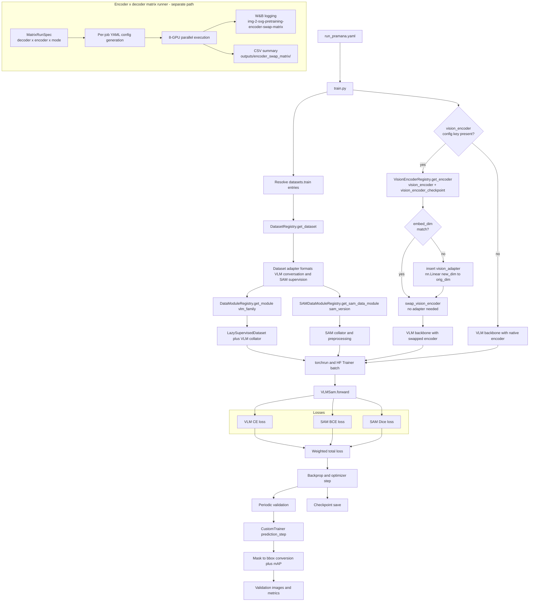

# Training Flow

This diagram focuses on a single training step, from dataset selection to checkpoint output. It includes the optional vision encoder swap branch introduced in v0.3.x and the encoder×decoder matrix runner path added in v0.4.0.

## Notes

- Multiple training datasets can be listed in `datasets.train`; `build_multi_dataset(...)` resolves them before concatenation.
- The active `vlm_family` owns tokenizer extension, chat formatting, and family-specific positional handling, while `sam_version` owns mask/image preprocessing.
- The optional `vision_encoder` config key triggers an encoder swap via `swap_vision_encoder` after composite construction. When dimensions differ, a `vision_adapter` (`nn.Linear`) is inserted between the new encoder and the VLM-internal projector. The adapter is stored as `vlm_wrapper.vision_adapter` for separate optimizer-group routing.
- For Molmo decoders, the swap goes through `MolmoVisionBackboneAdapter`, which wraps the new encoder alongside the original `image_projector` and routes through `_molmo_patchify_images`.
- Validation uses the custom trainer path so mask predictions can be turned into visualization artifacts and detection metrics.
- The final export is saved to `<output_dir>/final` after `trainer.save_model(...)`.
- The matrix runner (`scripts/run_encoder_swap_matrix.py`) is a separate parallel execution path that drives the 4 × 10 × 2 = 80 job matrix. It does not go through the main `train.py` loop; each job generates its own YAML config and runs independently on an assigned GPU.

Relevant files:

- [training_core/train/train.py](../training_core/train/train.py)
- [training_core/train/train_utils.py](../training_core/train/train_utils.py)
- [training_core/train/custom_trainer.py](../training_core/train/custom_trainer.py)
- [training_core/validation/compute_metrics.py](../training_core/validation/compute_metrics.py)
- [training_core/builders/swap_vision_encoder.py](../training_core/builders/swap_vision_encoder.py)
- [training_core/builders/build_vlm_sam.py](../training_core/builders/build_vlm_sam.py)
- [training_core/matrix/encoder_swap_matrix.py](../training_core/matrix/encoder_swap_matrix.py)
- [scripts/run_encoder_swap_matrix.py](../scripts/run_encoder_swap_matrix.py)
